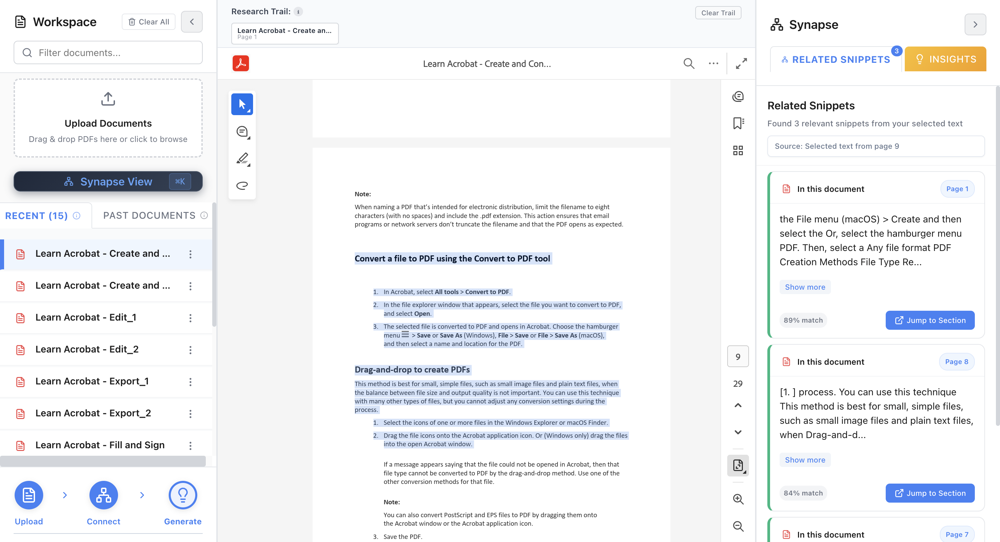
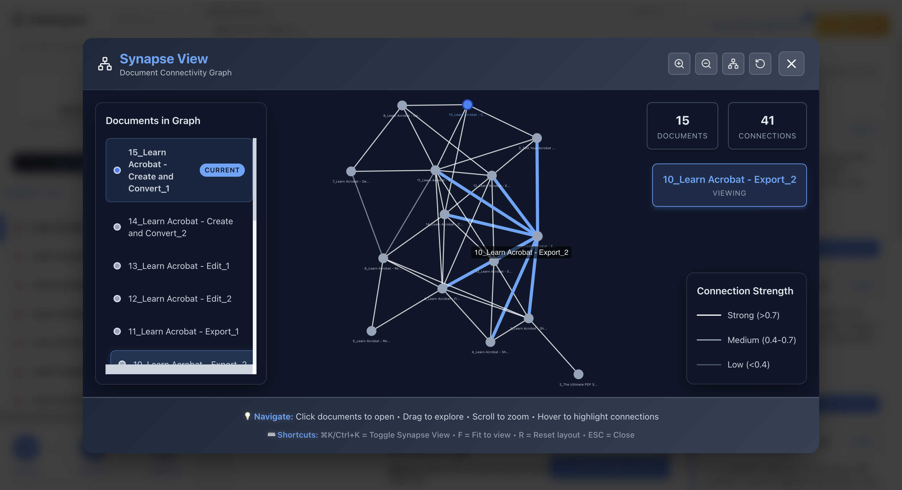

# Synapse-Docs

An intelligent document experience platform that transforms static PDFs into interactive, queryable knowledge bases with AI-powered insights and semantic connections.


**Production Application**: [https://synapse-docs-833062842245.us-central1.run.app/](https://synapse-docs-833062842245.us-central1.run.app/)

### ADOBE EMBED API KEY for Evaluation

> **Note:** For evaluation purposes, a temporary API key is provided below as an exception to standard security protocols as requested. This key is domain-restricted for this demo and is not for production use. It will be permanently revoked after the hackathon concludes.

```bash
ADOBE_EMBED_API_KEY=3cd771f42fa94558ba086000f5146e2e
```


## Table of Contents

| #   | Section                                                      |
| --- | ------------------------------------------------------------ |
| 1   | [Overview](#overview)                                        |
| 2   | [Problem & Solution](#problem--solution)                     |
| 3   | [Live Demo](#live-demo)                                      |
| 4   | [Technology Stack](#technology-stack)                        |
| 5   | [System Architecture](#system-architecture)                  |
| 6   | [Key Features](#key-features)                                |
| 7   | [Quick Start](#quick-start)                                  |
| 8   | [Development Setup](#development-setup)                      |
| 9   | [Deployment](#deployment)                                    |
| 10  | [API Documentation](#api-documentation)                      |
| 11  | [Project Structure](#project-structure)                      |
| 12  | [Environment Variables](#environment-variables)              |
| 13  | [Performance Specifications](#performance-specifications)    |

## Overview

Synapse-Docs is a full-stack web application built for the Adobe India Hackathon 2025 Grand Finale. It implements a sophisticated document intelligence system that enables users to upload PDF documents, view them with high fidelity, select text passages, and instantly discover related content across their entire document library. 

**Built on Previous Rounds**: This application refactors and integrates the complete Challenge 1A (PDF understanding engine) and Challenge 1B (persona-driven document intelligence) code from previous hackathon rounds into a production-ready backend service.

The platform leverages advanced AI capabilities including semantic search, knowledge graph visualization, contextual insights generation, and audio podcast creation, all powered by the robust document processing pipeline developed in earlier rounds.

## Problem & Solution

### Adobe Hackathon 2025 Challenge: "From Brains to Experience"

**Context & Problem**: Users (researchers, students, professionals) deal with large volumes of documents daily — research papers, business reports, study material, etc. Over time, it becomes impossible to remember all details or connect insights across these documents.

**Goal of the System**: Help users by:
- Quickly surfacing related, overlapping, contradicting, examples or other insightful information from their personal document library
- Using AI/LLM-powered capabilities to enhance understanding and engagement — grounded on the documents they've read

### User Journey Flow

**Step 1 - Reading & Selection**
- **Trigger**: User is reading a document within the system
- **Action**: User selects a portion of text (e.g., scientific method, business strategy, key metric)
- **System Response**: Instantly surfaces relevant sections from past documents using semantic search and LLM context-aware matching

**Step 2 - Insight Generation**
- **Goal**: Go beyond finding related text
- **System Value**: Generate insights related to selected text (overlapping, contradictory viewpoints, examples)
- **Grounding**: All results sourced from user's uploaded documents — not generic web sources

**Step 3 - Rich Media Experience**
- **Optional Action**: User requests an audio overview/podcast for the selected topic
- **System Capabilities**: Generate natural-sounding, engaging audio using selected text as seed
- **Content Structure**: Highlights key points, contrasts perspectives, connects concepts

### Example Use Case
A researcher reading a paper on "neural network training techniques" selects a paragraph on "transfer learning." The system instantly shows:
- Similar methods in 3 previous papers
- Contradictory findings from another study
- How another paper has extended or found problems with the technique
- An audio overview/podcast summarizing these related sections and insights

## Live Demo

**Production Application**: [https://synapse-docs-833062842245.us-central1.run.app/](https://synapse-docs-833062842245.us-central1.run.app/)

## Technology Stack

| Component | Technology | Purpose |
|-----------|------------|---------|
| **Frontend** | React 18 + Vite | Interactive user interface |
| **PDF Rendering** | Adobe PDF Embed API | High-fidelity PDF viewing |
| **Backend** | Python FastAPI | REST API and business logic |
| **Database** | SQLite + SQLModel | Document metadata storage |
| **Vector Search** | Faiss + Sentence Transformers | Semantic similarity search |
| **AI/LLM** | Google Gemini 2.5 Flash | Insights and content generation |
| **Text-to-Speech** | Azure Cognitive Services | Audio podcast generation |
| **Knowledge Graph** | React Force Graph 2D | Interactive relationship visualization |
| **Containerization** | Docker | Deployment and isolation |
| **Cloud Platform** | Google Cloud Run | Production hosting |
| **CI/CD** | Google Cloud Build | Automated deployment |

### Refactored Components from Previous Rounds

| Round | Original Component | Refactored Into | Purpose |
|-------|-------------------|-----------------|---------|
| **1A** | PDF Understanding Engine | `DocumentParser` Service | 4-stage PDF processing pipeline |
| **1A** | Text Extraction Logic | `document_parser.py` | CRF-based heading detection |
| **1A** | Layout Analysis | `DocumentParser` | Section-based content structuring |
| **1B** | Persona-driven Intelligence | `EmbeddingService` | Semantic text understanding |
| **1B** | Document Analysis | `embedding_service.py` | Vector-based similarity search |
| **1B** | Search Logic | `FaissService` | High-performance semantic matching |

## System Architecture

### Three-Panel "Cockpit" Design

```
┌─────────────────┬─────────────────────┬─────────────────┐
│   Workspace     │      Workbench      │     Synapse     │
│  (Left Panel)   │   (Center Panel)    │  (Right Panel)  │
├─────────────────┼─────────────────────┼─────────────────┤
│ Document        │ PDF Viewer with     │ Connections &   │
│ Library         │ Text Selection      │ Insights        │
│                 │ & Action Halo       │                 │
│ • Upload PDFs   │ • Adobe Embed API   │ • Related Text  │
│ • Manage Docs   │ • Context Lens      │ • AI Insights   │
│ • Quick Access  │ • Breadcrumb Trail  │ • Audio Podcast │
│                 │ • Page Navigation   │ • Knowledge Graph│
└─────────────────┴─────────────────────┴─────────────────┘
```



### Data Processing Pipeline

**Refactored from Previous Rounds**:
- **Round 1A Integration**: Complete PDF understanding engine refactored into backend services
- **Round 1B Integration**: Persona-driven document intelligence system integrated for semantic search

```
PDF Upload → Document Parser (1A) → Text Extraction → Embedding Generation (1B) → Vector Storage
                ↓
Knowledge Graph Generation ← Semantic Search ← User Text Selection
                ↓
AI Insights & Audio Generation ← Context Assembly ← Related Content Retrieval
```

## Key Features

### Core Hackathon Features (Mandatory)

#### PDF Handling
- **Bulk Upload**: Upload multiple PDFs representing "past documents" user has read
- **Fresh Upload**: Open additional PDFs as "current document" being read
- **High-Fidelity Display**: Adobe PDF Embed API with zoom, pan, and navigation

#### Connecting the Dots
- **Intelligent Text Selection**: Real-time semantic search triggered by user text selection
- **Cross-Document Connections**: Automatically surfaces up to 5 relevant sections across PDFs
- **Section-Based Results**: Logical document sections (headings with content) as defined in Round 1A
- **Smart Snippets**: 2-4 sentence extracts with source attribution and navigation
- **One-Click Navigation**: Click snippets to jump to relevant PDF sections


#### Performance Requirements
- **Speed**: Sub-500ms response time for text selection to results
- **Accuracy**: High-relevance semantic matching for user engagement
- **Document Processing**: Follows Round 1A/1B ingestion speed limits

### Bonus Features (+10 Points Total)

#### Insights Bulb (+5 Points)
- **Key Takeaways**: LLM-powered analysis of selected content
- **"Did You Know?" Facts**: Contextual information discovery
- **Contradictions/Counterpoints**: Cross-document conflict detection
- **Examples**: Supporting evidence from document library
- **Cross-Document Inspirations**: Thematic connections and insights

#### Audio Overview/Podcast Mode (+5 Points)
- **Multi-Speaker Podcasts**: 2-5 minute conversational audio (preferred format)
- **Single Speaker Overviews**: Alternative audio format option
- **Context Integration**: Based on current section + related sections + insights
- **Azure TTS**: Production-ready speech synthesis
- **Content Grounding**: All audio content sourced from user's uploaded documents

### Advanced AI Features
- **Contextual Insights**: LLM-powered analysis generating takeaways, contradictions, and examples
- **Knowledge Graph**: Interactive visualization of document relationships and themes
- **Semantic Search**: Vector-based similarity matching using sentence transformers
- **Breadcrumb Navigation**: Trail-based navigation system for exploration tracking


### Technical Features
- **Session Management**: Isolated user sessions with persistent state
- **Performance Optimization**: Sub-second response times for text selection
- **Scalable Architecture**: Cloud-native design with auto-scaling capabilities
- **Docker Containerization**: Single-command deployment with all dependencies

## Quick Start

### Adobe Hackathon 2025 - Docker Deployment [Compliant with the expected run]

Following the exact hackathon evaluation requirements:
We have run and tested using the following command, replace with your actual API keys.

```bash
# Clone the repository
git clone https://github.com/sooravali/synapse-docs.git
cd synapse-docs

# Build the Docker image (Adobe evaluation command)
docker build --platform linux/amd64 -t synapse-docs:latest .

# Run with hackathon environment variables
docker run \
  -v ~/hackathon-credentials:/credentials \
  -e ADOBE_EMBED_API_KEY=<your_adobe_embed_api_key> \
  -e LLM_PROVIDER=gemini \
  -e GOOGLE_APPLICATION_CREDENTIALS=/credentials/<your_service_account>.json \
  -e GEMINI_MODEL=gemini-2.5-flash \
  -e TTS_PROVIDER=azure \
  -e AZURE_TTS_KEY=<your_azure_tts_key> \
  -e AZURE_TTS_ENDPOINT=<your_azure_tts_endpoint> \
  -p 8080:8080 \
  synapse-docs:latest
```

**Access the application**: [http://localhost:8080](http://localhost:8080)

### Adobe Evaluation Format

```bash
# Adobe will use this exact command format for evaluation:
docker run \
  -v /path/to/credentials:/credentials \
  -e ADOBE_EMBED_API_KEY=<ADOBE_EMBED_API_KEY> \
  -e LLM_PROVIDER=gemini \
  -e GOOGLE_APPLICATION_CREDENTIALS=/credentials/adbe-gcp.json \
  -e GEMINI_MODEL=gemini-2.5-flash \
  -e TTS_PROVIDER=azure \
  -e AZURE_TTS_KEY=<TTS_KEY> \
  -e AZURE_TTS_ENDPOINT=<TTS_ENDPOINT> \
  -p 8080:8080 \
  synapse-docs:latest
```

### Local Development

```bash
# Backend setup
cd backend
pip install -r requirements.txt
uvicorn app.main:app --reload --port 8000

# Frontend setup (new terminal)
cd frontend
npm install
npm run dev
```

## Deployment

### Google Cloud Run (Production)

The application is deployed using Google Cloud Build with automatic CI/CD:

```bash
# Configure Google Cloud
gcloud config set project synapse-docs-468420
gcloud builds submit --config cloudbuild.yaml
```

**Configuration Features**:
- Auto-scaling (0-2 instances)
- 8GB memory allocation
- Cloud Storage integration
- Secret management for API keys
- Load balancing and SSL termination

### Environment Configuration - Adobe Hackathon Requirements

| Variable | Value/Purpose | Required | Adobe Evaluation |
|----------|---------------|----------|------------------|
| `ADOBE_EMBED_API_KEY` | PDF rendering service | Optional | Provided by candidate |
| `LLM_PROVIDER` | `gemini` | Required | Set by Adobe |
| `GOOGLE_APPLICATION_CREDENTIALS` | `/credentials/adbe-gcp.json` | Required | Set by Adobe |
| `GEMINI_MODEL` | `gemini-2.5-flash` | Required | Set by Adobe |
| `TTS_PROVIDER` | `azure` | Required | Set by Adobe |
| `AZURE_TTS_KEY` | Azure TTS API key | Required | Set by Adobe |
| `AZURE_TTS_ENDPOINT` | Azure TTS service URL | Required | Set by Adobe |

### Hackathon Compliance Features

**Sample Script Integration**:
- `chat_with_llm.py` - Used for all LLM interactions with Gemini
- `generate_audio.py` - Used for all Azure TTS audio generation
- Environment variable compliance - Exact adherence to Adobe specifications

**Alternative Configurations Supported**:
```bash
# Using Gemini for both LLM and TTS
docker run -v /path/to/credentials:/credentials \
  -e ADOBE_EMBED_API_KEY=<key> -e LLM_PROVIDER=gemini \
  -e GOOGLE_APPLICATION_CREDENTIALS=/credentials/adbe-gcp.json \
  -e GEMINI_MODEL=gemini-2.5-flash -e TTS_PROVIDER=gcp \
  -p 8080:8080 synapse-docs:latest

# Using Local LLM (Ollama) and local TTS
docker run -e ADOBE_EMBED_API_KEY=<key> \
  -e LLM_PROVIDER=ollama -e OLLAMA_MODEL=llama3 \
  -e TTS_PROVIDER=local -p 8080:8080 synapse-docs:latest
```

## API Documentation

### Interactive Documentation
- **Swagger UI**: [http://localhost:8080/docs](http://localhost:8080/docs)
- **ReDoc**: [http://localhost:8080/redoc](http://localhost:8080/redoc)
- **OpenAPI Spec**: [http://localhost:8080/openapi.json](http://localhost:8080/openapi.json)

### Key Endpoints

| Endpoint | Method | Purpose |
|----------|--------|---------|
| `/api/v1/documents/upload` | POST | Upload and process PDFs |
| `/api/v1/search/semantic` | POST | Semantic text search |
| `/api/v1/insights/generate` | POST | Generate AI insights |
| `/api/v1/insights/podcast` | POST | Create audio podcasts |
| `/api/v1/graph/connectivity` | GET | Knowledge graph data |

## Project Structure

```
synapse-docs/
├── backend/                 # FastAPI backend application
│   ├── app/
│   │   ├── api/v1/         # API route definitions
│   │   ├── core/           # Configuration and database
│   │   ├── crud/           # Database operations
│   │   ├── models/         # Data models
│   │   ├── schemas/        # Pydantic schemas
│   │   └── services/       # Business logic services
│   ├── data/               # Storage directories
│   └── requirements.txt    # Python dependencies
├── frontend/               # React frontend application
│   ├── src/
│   │   ├── components/     # React components
│   │   ├── api/           # API client functions
│   │   └── services/      # Frontend services
│   └── package.json       # Node.js dependencies
├── Dockerfile             # Container configuration
├── cloudbuild.yaml        # Google Cloud Build config
└── README.md              # This file
```

## Performance Specifications

### Adobe Hackathon Requirements

**Response Times**:
- **Text Selection to Results**: < 500ms (critical for user engagement)
- **Related Sections/Snippets**: Load quickly after selection for better UX
- **Document Upload Processing**: Follows earlier round limits (~30s per document)
- **Insight Generation**: < 10s for LLM-powered analysis
- **Audio Podcast Generation**: < 60s for 2-5 minute content

**Quality Metrics**:
- **Relevance**: High-accuracy semantic matching for trust
- **Speed**: Minimize delay between text selection and insight surfacing
- **Engagement**: Natural, dynamic audio (not robotic)
- **Grounding**: All content sourced from user's uploaded documents

### Technical Specifications

**System Requirements**:
- **Memory**: 8GB per Cloud Run instance
- **CPU**: 2 vCPUs per instance
- **Docker Image Size**: ~4GB (optimized, preferably under 20GB limit)
- **Storage**: Persistent Cloud Storage volumes

**Scalability**:
- **Concurrent Users**: Up to 10 per Cloud Run instance
- **Document Storage**: Cloud Storage with unlimited capacity
- **Vector Index**: In-memory Faiss with fast similarity search
- **Auto-scaling**: 0-2 instances based on traffic

### Evaluation Criteria

**Stage 1 - Backend Evaluation (50%)**:
- Core Functionality: 20 points
- Technical Implementation: 15 points
- Integration of Prior Rounds: 10 points
- Performance & Reliability: 5 points

**Stage 2 - Live Finale (50%)**:
- Demo Effectiveness: 15 points
- UX & Design Quality: 10 points
- Innovation & Creativity: 10 points
- Impact & Storytelling: 10 points
- Q&A Handling: 5 points

**Bonus Points**:
- Insights Bulb: +5 points
- Podcast Mode: +5 points

---

**For detailed component documentation**:
- [Backend Documentation](./backend/README.md)
- [Frontend Documentation](./frontend/README.md)

**Hackathon Submission**: Adobe India Hackathon 2025 Grand Finale - "Connecting the Dots Challenge"
